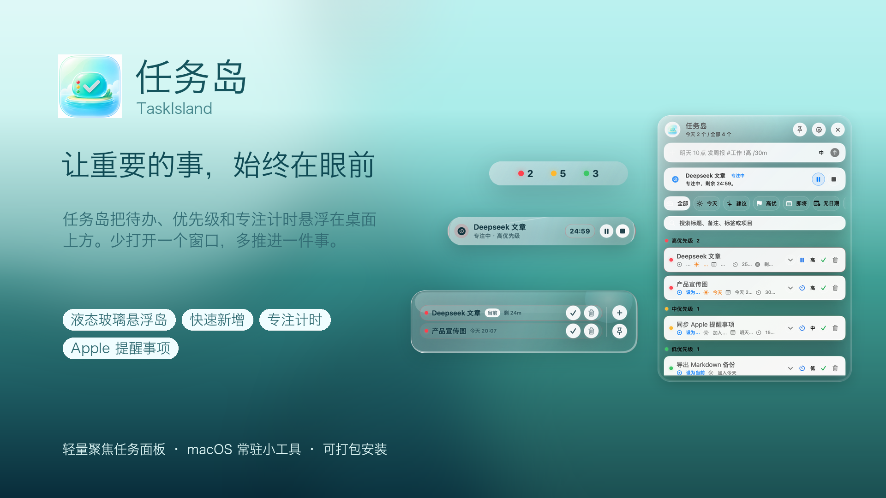
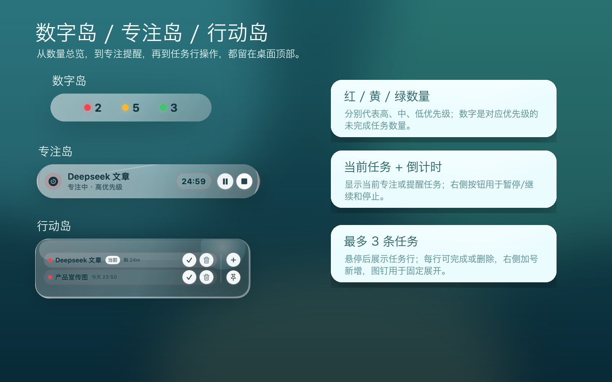
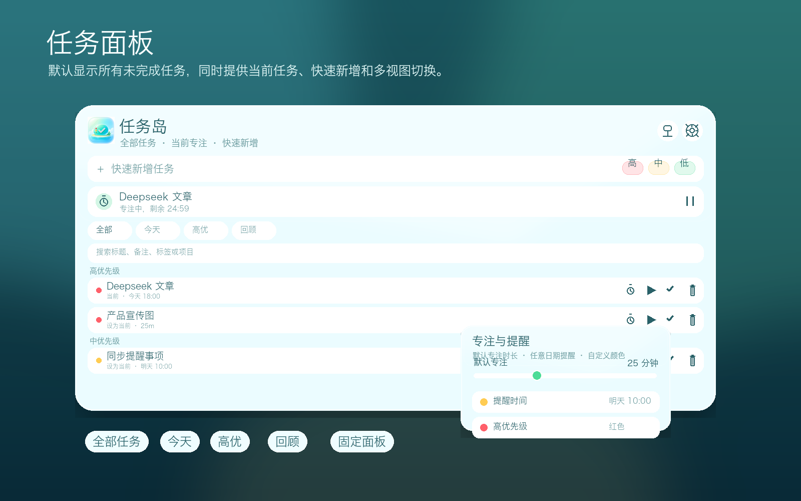
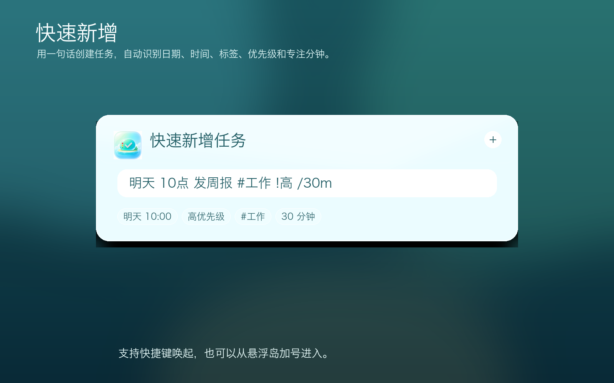
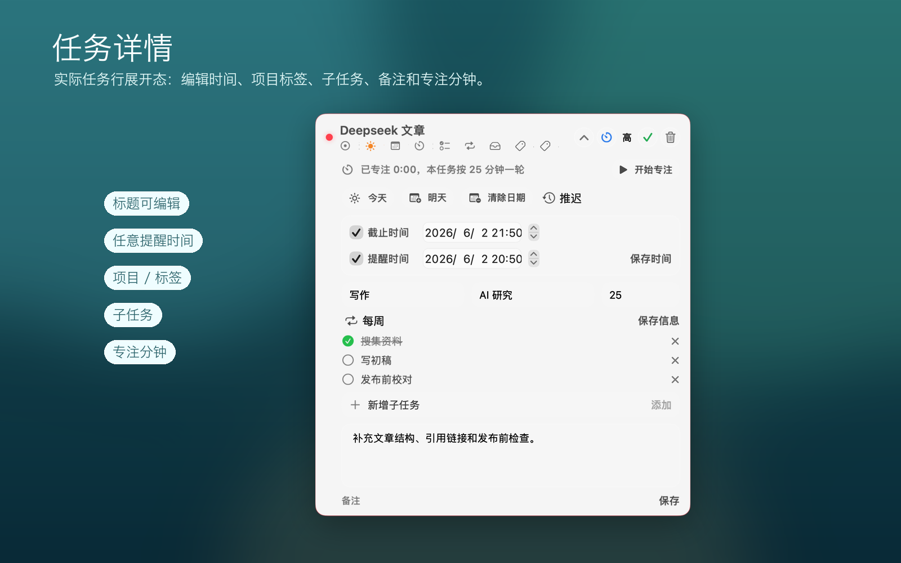
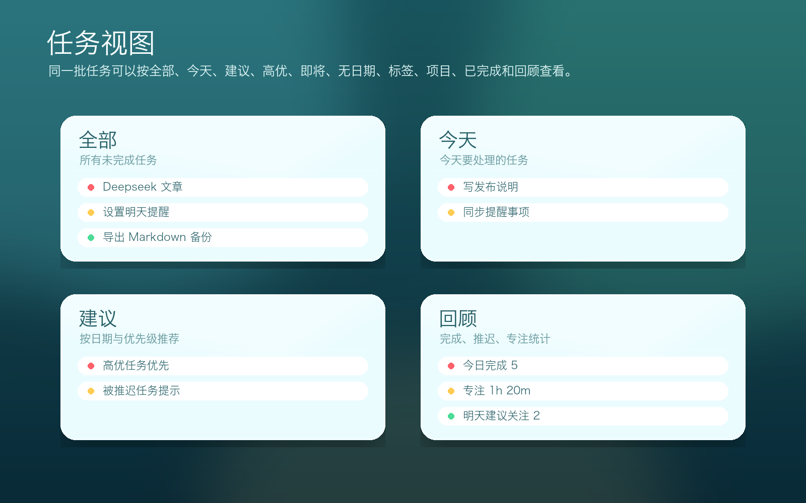
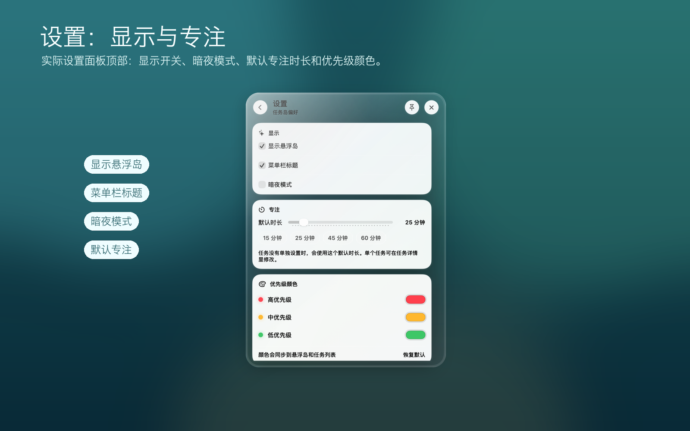
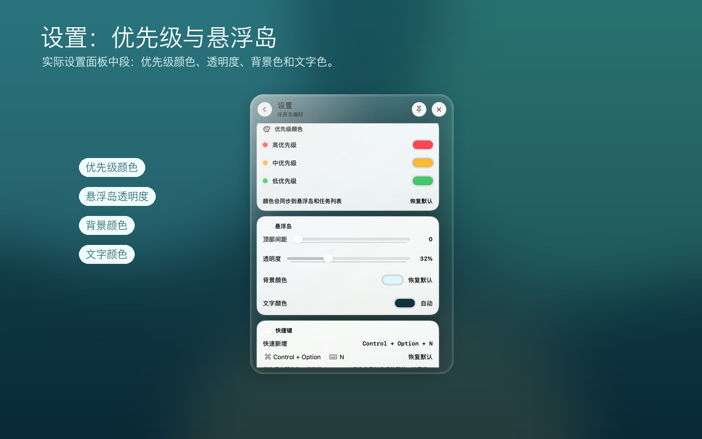
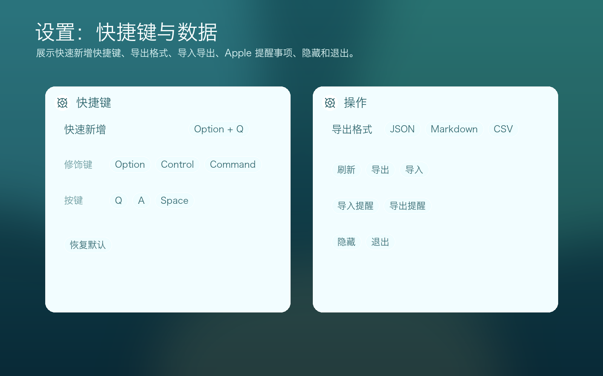

# TaskIsland

TaskIsland is a local-first floating task app for macOS. It keeps important tasks, reminders, and focus timing at the top of your desktop through a lightweight liquid-glass island, so you can capture, review, and move tasks forward without switching apps.



[中文 README](README.md)

## Highlights

- **Three island states**: Number Island shows high / medium / low priority counts; Focus Island shows the active task, countdown, pause, and stop; Action Island previews up to 3 important tasks with quick add, pin, complete, and delete controls.
- **Current task and focus**: mark any task as current, then use it from the focus card and menu bar. Starting focus moves the island into medium mode with pause, resume, and stop controls.
- **Quick add**: press the default `Control + Option + N` shortcut and type natural language such as `tomorrow 10:00 weekly report #work !high /30m`.
- **Task panel views**: All, Today, Suggestions, High Priority, Upcoming, No Date, Tags, Projects, Completed, and Review.
- **Rich task details**: notes, arbitrary due date, arbitrary reminder time, repeat rule, project, tags, estimated focus minutes, postpone, and “set as current”.
- **Custom appearance**: dark glass mode, island transparency, background color, text color, priority colors, top position, and drag placement.
- **Local-first data**: SwiftData storage, no account required; JSON, Markdown, and CSV import / export.
- **macOS integration**: Apple Reminders import / export, local notifications, `taskisland://` URL Scheme, and installer login-start configuration.
- **Installable builds**: scripts generate `.app`, `.pkg`, and `.dmg` packages for `/Applications/任务岛.app`.

## Release Notes

### 0.1.1 - 2026-06-02

- Added a shared version file used by the `.app`, `.pkg`, and `.dmg` packaging scripts.
- Unified the three island state names across README copy and posters: Number Island, Focus Island, and Action Island.
- Switched README interface images to actual UI renders and removed subtask claims from public documentation.

### 0.1.0 - 2026-06-01

- First usable local build with the floating island, task panel, quick add, focus timer, reminders, import / export, and macOS packaging scripts.

## Versioning Policy

Every user-visible change to features, UI, documentation previews, or installers should update:

- The root `VERSION` file.
- The release notes in README.
- Fresh installer builds, with matching `.dmg` and `.pkg` files uploaded to GitHub Releases.

## Interface Tour

### Floating Island



TaskIsland has three desktop states: Number Island for high / medium / low priority counts, Focus Island for active focus or reminder tasks with countdown controls, and Action Island for hover or pinned task actions with up to 3 important tasks.

### Task Panel



Clicking the island opens the full task panel. It starts with all incomplete tasks and keeps current focus, task lists, view switching, search, and panel pinning in one place.

### Quick Add



Quick add supports natural-language input for dates, times, priorities, tags, and estimated focus minutes.

### Task Details



Each task supports title editing, notes, due time, reminder time, repeat rule, project, tags, postponing, “set as current”, and per-task focus minutes.

### Task Views



Tasks can be viewed by All, Today, Suggestions, High Priority, Upcoming, No Date, Tags, Projects, Completed, and Review.

### Settings: Display and Focus



Settings cover the floating island toggle, menu bar title, dark mode, default focus duration, and priority colors.

### Settings: Priorities and Island



Configure high / medium / low priority colors, island transparency, background color, text color, and top placement.

### Settings: Shortcuts and Data



Customize quick-add shortcuts, choose export formats, refresh, import, export, import / export Apple Reminders, hide, and quit.

## Requirements

- macOS 26 or later
- Xcode / Swift 6.2 toolchain

## Run

```sh
swift run TaskIsland
```

After launch:

- Click the floating island to open the task panel.
- Hover the island to preview tasks.
- Press the default `Control + Option + N` shortcut to open quick add. The shortcut can be customized with common modifier and letter / space combinations.
- Press `Esc` or the close button to dismiss quick add.

## Build

Build the `.app` bundle:

```sh
chmod +x Scripts/package-app.sh
Scripts/package-app.sh
open .build/package/任务岛.app
```

Build the `.pkg` installer:

```sh
chmod +x Scripts/package-pkg.sh
Scripts/package-pkg.sh
open dist/TaskIsland-0.1.1.pkg
```

Build the `.dmg` image:

```sh
chmod +x Scripts/package-dmg.sh
Scripts/package-dmg.sh
open dist/TaskIsland-0.1.1.dmg
```

The `.pkg` installer places `任务岛.app` in `/Applications`, registers it with LaunchServices / Spotlight, and starts the app after installation.

## Checks

```sh
swift run TaskIslandChecks
```

The check target covers task creation, completion, deletion, recurrence, priority, date parsing, focus timing, import / export, and Todoist-style CSV import.

## URL Scheme

TaskIsland can be called from macOS Shortcuts or launchers:

```text
taskisland://add?title=tomorrow%2010:00%20weekly%20report%20%23work%20!high%20/30m
taskisland://focus
taskisland://complete
taskisland://show
```

## Project Layout

```text
Sources/TaskIslandCore      task model, storage, parsing, import / export
Sources/TaskIsland          macOS app, island, panels, shortcuts, integrations
Sources/TaskIslandChecks    lightweight validation target
Resources                   app icon
Scripts                     packaging and README image generation scripts
assets/posters              GitHub presentation posters
assets/screenshots          GitHub interface screenshots
docs                        research and project notes
```

## Distribution Note

This build is not yet signed and notarized with Apple Developer ID. Before distributing to end users, sign the app / installer with Developer ID certificates and submit the package to Apple Notary Service.

## License

No open-source license has been declared yet. All rights are reserved unless a LICENSE file is added later.
