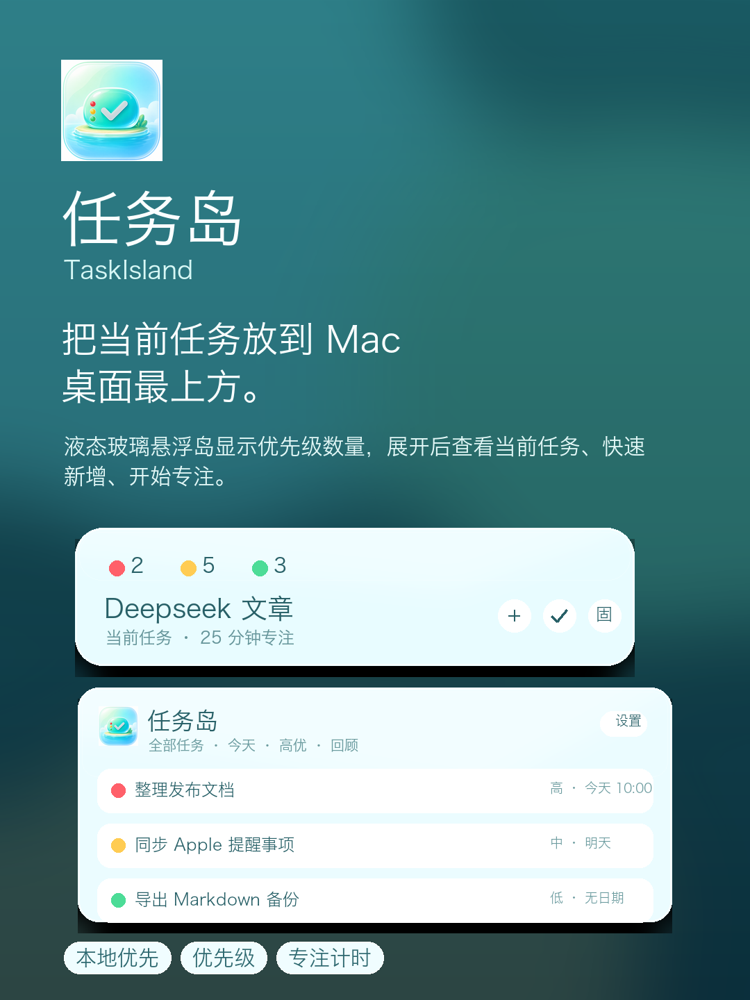

# 任务岛

任务岛是一款本地优先的 macOS 悬浮任务工具。它把“当前该做什么”放在屏幕顶部，用一个轻量的液态玻璃悬浮岛显示任务优先级、当前任务和快速操作，适合想要保持桌面聚焦、又不想打开完整任务管理软件的人。


[English README](README.en.md)

## 亮点

- **常驻悬浮岛**：收起时显示高/中/低优先级任务数量，悬停展开后显示最多 3 条任务。
- **当前任务与专注**：任务面板顶部固定显示“当前任务”或“专注中”，支持一键开始/暂停专注计时。
- **快速新增**：全局快捷键打开快速新增面板，支持自然语言输入，例如 `明天 10点 发周报 #工作 !高 /30m`。
- **任务面板**：支持全部、今天、建议、高优、即将、无日期、标签、项目、已完成和回顾视图。
- **任务详情**：支持备注、任意截止时间、任意提醒时间、重复规则、项目、标签、子任务、预计专注分钟、推迟、设为当前。
- **可自定义外观**：支持暗夜玻璃模式、悬浮岛透明度、背景颜色、文字颜色、优先级颜色和顶部位置。
- **本地优先**：使用 SwiftData 本地存储，不依赖账号；支持 JSON、Markdown、CSV 导入导出。
- **系统集成**：支持 Apple 提醒事项导入/导出、本地通知、`taskisland://` URL Scheme、登录启动安装配置。
- **可打包安装**：提供 `.app`、`.pkg`、`.dmg` 打包脚本，可安装到 `/Applications/任务岛.app`。

## 预览

| 16:9 宣传图 | 3:4 竖版宣传图 |
| --- | --- |
|  |  |

## 系统要求

- macOS 26 或更新版本
- Xcode / Swift 6.2 工具链

## 运行

```sh
swift run TaskIsland
```

启动后：

- 点击顶部悬浮岛可打开任务面板。
- 鼠标悬停悬浮岛可查看任务预览。
- 默认 `Option + Q` 打开快速新增面板，也可以在设置里自定义快捷键。
- 按 `Esc` 或点击关闭按钮可关闭快速新增面板。

## 打包

构建 `.app`：

```sh
chmod +x Scripts/package-app.sh
Scripts/package-app.sh
open .build/package/任务岛.app
```

构建 `.pkg` 安装包：

```sh
chmod +x Scripts/package-pkg.sh
Scripts/package-pkg.sh
open dist/TaskIsland-0.1.0.pkg
```

构建 `.dmg`：

```sh
chmod +x Scripts/package-dmg.sh
Scripts/package-dmg.sh
open dist/TaskIsland-0.1.0.dmg
```

`.pkg` 会把 `任务岛.app` 安装到 `/Applications`，注册系统应用索引，并在安装后启动应用。

## 检查

```sh
swift run TaskIslandChecks
```

检查脚本覆盖任务新增、完成、删除、循环、优先级、日期解析、专注计时、子任务、导入导出和 Todoist 风格 CSV 导入等规则。

## URL Scheme

可通过 macOS 快捷指令或其他启动器调用：

```text
taskisland://add?title=明天%2010点%20发周报%20%23工作%20!高%20/30m
taskisland://focus
taskisland://complete
taskisland://show
```

## 目录结构

```text
Sources/TaskIslandCore      核心任务模型、存储、解析、导入导出
Sources/TaskIsland          macOS App、悬浮岛、面板、快捷键、系统集成
Sources/TaskIslandChecks    轻量检查脚本
Resources                   应用图标
Scripts                     打包与海报生成脚本
assets/posters              GitHub 展示海报
docs                        调研和项目资料
```

## 发布说明

当前版本是本地构建版，未接入 Apple Developer ID 正式签名和公证。分发给其他用户前，建议使用 Developer ID Application / Installer 证书签名，并通过 Apple Notary Service 公证。

## 许可

暂未声明开源许可证。除非后续添加 LICENSE 文件，否则保留所有权利。
